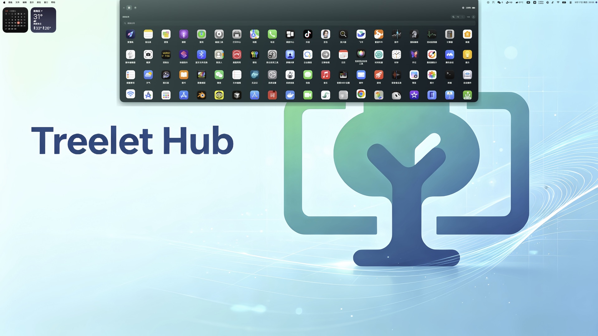
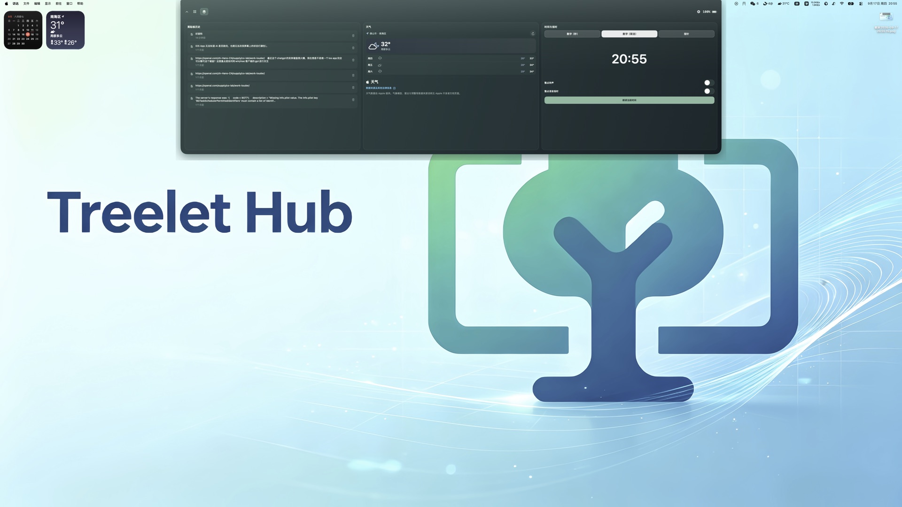
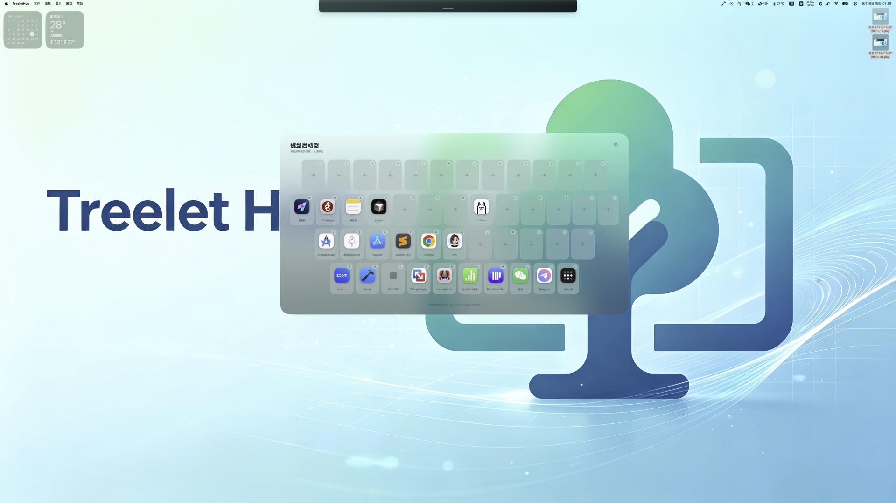

  

<h1 align="center">TreeletHub</h1>

  <strong>Mac 快捷控制台</strong> — 灵动岛、键盘启动器、蜂巢启动墙，手机也可遥控 
  <em>Dynamic Island, keyboard launcher, and a honeycomb app wall — plus iPhone &amp; Android remote</em>

  <a href="https://treelet.us/treelethub/">官网</a> ·
  <a href="CHANGELOG.md">Changelog</a> ·
  <a href="https://github.com/shuzhzh/TreeletHub/releases">Releases</a> ·
  <a href="docs/USER_GUIDE.zh-CN.md">使用说明</a> ·
  <a href="docs/FAQ.zh-CN.md">FAQ</a>

  当前 <strong>Mac 1.3.0</strong>
  · <a href="https://models.appda.store/treelethub/TreeletHub.dmg">下载 DMG</a>
  · <a href="docs/release-notes-v1.3.0.md">本版说明</a>

---

## 功能一览

<table>
  <tr>
    <td width="33%" valign="top">
      
      
<strong>灵动岛 · 系统应用</strong> 贴边细条，展开后是本机应用墙：搜索、缩放图标，少去 Dock 里翻。

    </td>
    <td width="33%" valign="top">
      
      
<strong>灵动岛 · 工作台</strong> 媒体播放、天气、剪贴板、文件暂存等小组件并排，悬停贴边即可展开。

    </td>
    <td width="33%" valign="top">
      
      
<strong>键盘启动器</strong> 松开 Control 弹出屏幕键盘；<code>Control + 键</code> 随时唤起或隐藏对应 App。

    </td>
  </tr>
</table>

灵动岛与键盘启动器属于 **Pro**（一次性 $9.99，非订阅）。免费版可用蜂巢启动墙（最多 10 个应用），并用手机遥控。

---

## TreeletHub 是什么

TreeletHub 把常用 Mac 应用收进三套入口，减少在凌乱桌面和 Dock 里找图标：

1. **灵动岛**（Pro）— 屏幕顶部浮层：系统应用墙 + 工作台小组件  
2. **键盘启动器**（Pro）— 把高频 App 绑在固定按键上  
3. **蜂巢启动墙** — 主窗口 / 手机 / Apple Watch 同步的启动台  

同一 Wi‑Fi 下用 **6 位配对码** 连接 iPhone、iPad 或 Android，不需要 TreeletHub 账号。多台手机可同时连一台 Mac。

仅安装手机端无法使用，必须先装 Mac 客户端。

---

## 主要功能

| 功能 | 说明 |
|------|------|
| **灵动岛** | Pro。贴边收起、悬停展开。系统应用墙 + 工作台（媒体、天气、剪贴板、文件暂存等） |
| **键盘启动器** | Pro。松开 Control 唤出浮层；`Control + 键` 全局唤起 / 隐藏 |
| **蜂巢启动墙** | 捏合缩放、拖动浏览；可加 `.app`、网页快捷方式、系统操作；与手机同步 |
| **手机遥控** | iPhone / Android 点按启动 Mac 应用；Apps 页双指下滑可显示桌面 |
| **Apple Watch** | 同一套蜂巢启动墙 |
| **免费 / Pro** | 免费最多 10 个启动项；一次性 $9.99 解锁无限数量、灵动岛与键盘启动器 |

详情见 [使用说明](docs/USER_GUIDE.zh-CN.md) · [User guide](docs/USER_GUIDE.en.md)。

### 灵动岛（Mac · Pro）

主窗口配对码下方或右上角齿轮打开。展开后有两个页签：

- **系统应用**：本机已安装应用，可搜索、调节图标大小  
- **工作台**：媒体控制、天气（WeatherKit，可选定位）、剪贴板历史、文件暂存等  

贴边热区悬停会展开大面板；不挡工作区时可收成顶部细条。

### 键盘启动器（Mac · Pro）

1. 打开开关后，在「系统设置 → 隐私与安全性 → **输入监控**」允许 TreeletHub。  
2. **松开 Control** 弹出屏幕键盘；按已映射键启动应用，Esc 或点外部关闭。  
3. **Control + 按键** 不必先开浮层，也能唤起或隐藏对应应用。  
4. 首次开启按应用名首字母自动填键；点击添加 / 替换，拖拽交换。

仅用于监听 Control 与快捷键，**不记录、不上传**按键，也不向其他 App 注入按键。

### 蜂巢启动墙与手机遥控

1. 在 Mac 主窗口或蜂巢墙上点「+」绑定应用。  
2. 新装为空时会预填常用系统应用（只执行一次）。  
3. 手机 **Apps** 页与 Mac 同步；点按即在 Mac 上启动。  
4. 已配对时，Apps 页 **双指下滑** 可隐藏全部窗口并显示桌面。

Android 上点按 **Codex** 仍可打开控制键盘（深链接 / 本机 CLI）。ChatGPT、Cursor 以及 iPhone 上的应用都只负责启动，不再注入按键。

---

## 下载

| 平台 | 链接 |
|------|------|
| **Mac 1.3.0** | [CDN DMG](https://models.appda.store/treelethub/TreeletHub.dmg)（国内直装） |
| **iPhone / iPad** | [App Store](https://apps.apple.com/app/treelethub-%E6%95%88%E7%8E%87-%E6%8E%A7%E5%88%B6%E5%8F%B0/id6762348247) |
| **Android** | [Google Play](https://play.google.com/store/apps/details?id=com.treelet.treelethub) · [APK 1.3](https://github.com/shuzhzh/TreeletHub/releases/download/android-v1.3/TreeletHub-Android-1.3.apk) |
| **产品页** | [treelet.us/treelethub](https://treelet.us/treelethub/) |

  
  &nbsp;&nbsp;&nbsp;
  

左：iOS · App Store　右：Android · Google Play

### Mac 安装

1. 下载 DMG，把 TreeletHub 拖入「应用程序」。  
2. 若系统拦截：系统设置 → 隐私与安全性中允许，或右键 → **打开**。  
3. 允许 **本地网络**，以便与手机配对。  
4. 使用键盘启动器时，再允许 **输入监控**。灵动岛天气可选定位。

系统要求：macOS 14.6 或更高。

---

## 上手

1. **先安装 Mac 版**，打开后记下 **6 位配对码**。  
2. 手机打开 TreeletHub →「连接 Mac」，输入配对码；允许本地网络（Android 还需网络发现）。  
3. 在 Mac 蜂巢墙或灵动岛里放进常用应用；手机 Apps 页点按即可启动。  
4. 需要灵动岛 / 键盘启动器时，在 Mac 上一次性解锁 Pro。

---

## Changelog

完整记录见仓库根目录 **[CHANGELOG.md](CHANGELOG.md)**，GitHub 首页即可打开。

| 版本 | 日期 | 摘要 |
|------|------|------|
| **[Mac 1.3.0](https://github.com/shuzhzh/TreeletHub/releases/tag/v1.3.0)** | 2026-09-18 | 灵动岛、键盘启动器、蜂巢启动墙、一次性 Pro |
| [Android 1.3](https://github.com/shuzhzh/TreeletHub/releases/tag/android-v1.3) | 2026-07-26 | 控制键盘、PTT、显示桌面 |
| [Mac 1.2.7](https://github.com/shuzhzh/TreeletHub/releases/tag/v1.2.7) | 2026-07-26 | 控制键盘桥接（1.3.0 起改为深链接 / 仅启动） |

---

## 演示视频

| [演示 1](https://youtube.com/shorts/koVxMkCqO6Q) | [演示 2](https://youtube.com/shorts/Z-G5ocFpQhQ) |
|:---:|:---:|
|  |  |

---

## 隐私

配对、布局同步与遥控在局域网内完成。天气等少数功能按 [隐私政策](https://treelet.us/treelethub/treelet-hub-privacy.html) 联网。

- [用户协议](https://treelet.us/treelethub/treelet-hub-terms.html)
- [常见问题](docs/FAQ.zh-CN.md) · [GitHub Issues](https://github.com/shuzhzh/TreeletHub/issues)

---

© Treelet Tech · TreeletHub

  <a href="https://models.appda.store/treelethub/TreeletHub.dmg">Mac DMG</a> ·
  <a href="https://apps.apple.com/app/treelethub-%E6%95%88%E7%8E%87-%E6%8E%A7%E5%88%B6%E5%8F%B0/id6762348247">App Store</a> ·
  <a href="https://play.google.com/store/apps/details?id=com.treelet.treelethub">Google Play</a> ·
  <a href="https://treelet.us/treelethub/">官网</a>

